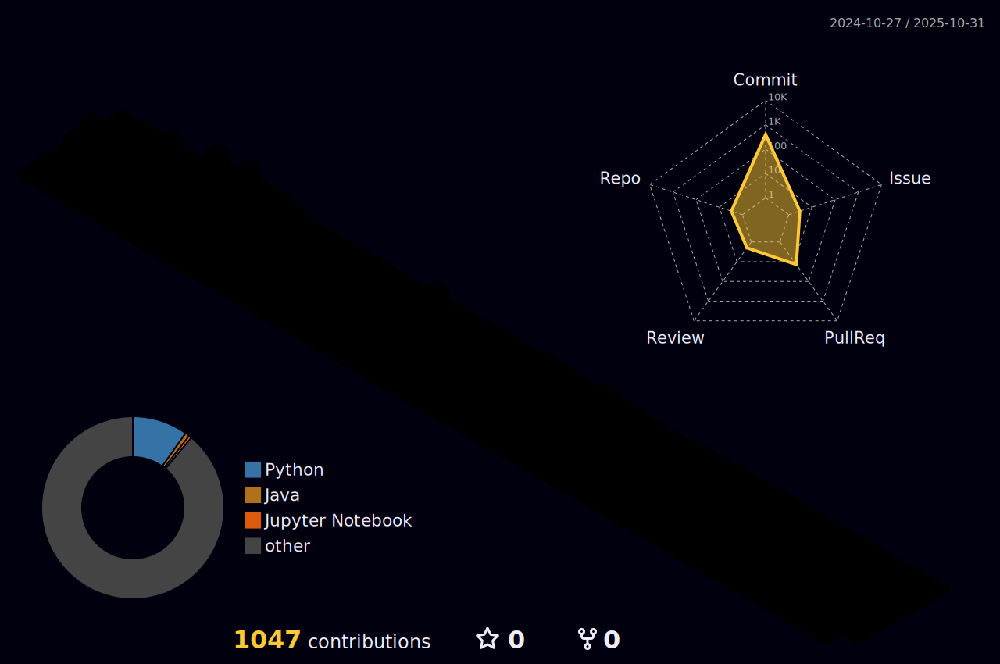

    <h1 align="center">🤾‍♂️ Poo Wei Chien (Rain)</h1>

    

    

  

---

### 💫 About Me
I'm a final-year AI student at Universiti Malaya with a strong passion for Software Engineering and Artificial Intelligence. I love diving into complex problems, exploring new technologies, and I aim to become an AI Engineer in the near future. Connect with me on LinkedIn to keep up with my journey!

---

### 🌐 Connect with Me

  

---

### 🛠️ Tech Stack

  
  
  
  
  
  

#### **AI & Machine Learning**

  
  
  
  
  

#### **Frameworks**

  
  
  
  
  
  

#### **Databases**

  
  
  

#### **Cloud & DevOps**

  
  
  
  
  

#### **Design & Multimedia**

  
  
  
  
  

---
### 🐍 My Contributions

  

  
  
---

### ⚡ My Stats

  
  
    
    

